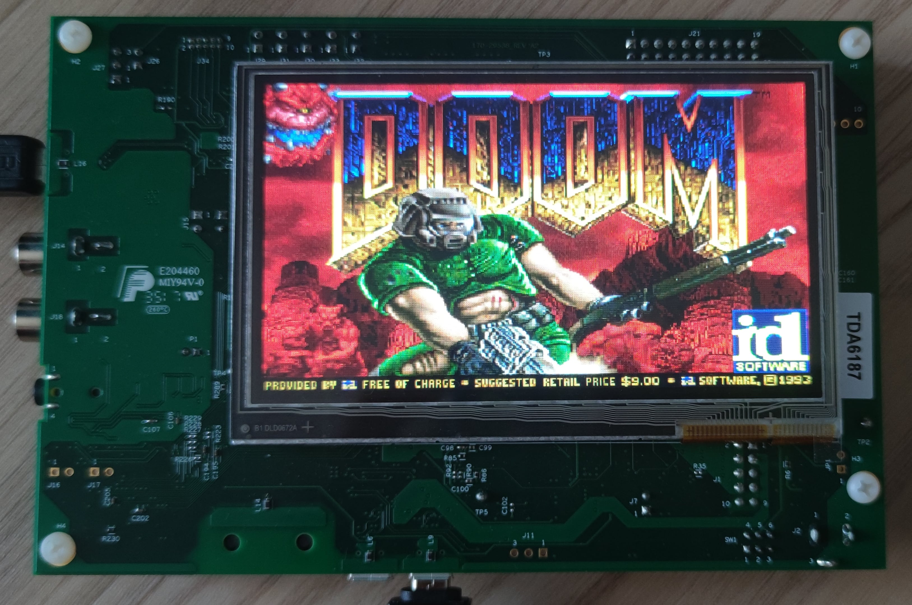

# RT1050-EVK-Doom

<figcaption><i>Photo of the complete project</i></figcaption>

 
 

Fully-playable Doom port with sound effects support, running on NXP's [RT1050-EVK](https://www.nxp.com/design/design-center/development-boards-and-designs/i-mx-evaluation-and-development-boards/i-mx-rt1050-evaluation-kit:MIMXRT1050-EVK)
evaluation kit. Based on [doomgeneric](https://github.com/ozkl/doomgeneric) with a few modifications.

## Functionalities

* Fully playable single player game (at the time of writing this I've completed 15 levels of Doom II with no issues :smile: ).
* Control via generic USB HID keyboard.
* WAD file read from FAT-formatted SD card.
* Working game saves.
* Working config saves.
* **Working sound effects** (using onboard WM8960 codec).
* Project written in MCUXpresso IDE.

## Hardware

### RT1050-EVK Evaluation Kit

The project is based on NXP's RT1050 Evaluation Kit. The version I used is the first one (EVK, not EVK**B**), because 
I already had that one in my Drawer With Various Devkits™ :wink: AFAIK the "only" difference between those versions
is that the second one uses MCU with lots of silicon issues fixed, so this project should work equally fine on either 
of them.

### Display

The project uses Rocktech RK043FN02H-CT TFT panel with 480*272 pixels resolution. From the information I've found it seems
that this display was offered as an optional accessory to RT1050-EVK by NXP, but I'm not sure - I got this board in used
condition and the display was already assembled onto the PCB.

### Keyboard

The keyboard driver implements a generic HID keyboard class, so any compatible keyboard should work out of the box via
microUSB to USB-A adapter. The driver is configured to work with USB2 peripheral (J10 connector on the board).

### SD card

The card is required to store game's WAD files, configs and game saves. It should be formatted as FAT32, as the project 
uses FatFs as a filesystem driver.

## Software

This project is basically an implementation of [doomgeneric](https://github.com/ozkl/doomgeneric) port for RT1052 MCU. Some 
modifications have been introduced to original doomgeneric code, such as e.g. removing original `I_FinishUpdate` routine
in `i_video.c` and replacing it with code directly converting Doom's video buffer to the format accepted by the used display,
to speed up rendering by avoiding intermediate step in frame buffer conversion. Also, some fixes have been implemented
in various places, but nothing major.

The feature that is not so commonly found in other embedded ports but is implemented in this one is a support for sound
effects. IIRC I've found only one other project that implemented it and it was `esp32-doom` or some derivative. That made
coding this functionality quite challenging at the beginning, but ultimately much more satisfying when it finally 
started working :smile: There's still no support for the music playback, but even just sound effects increase playability 
a lot!

## Startup

If you'd like to run this project, you'll need everything listed in [Hardware](#hardware) section. You'll also need to 
install MCUXpresso, as the project is written in that IDE.

After importing the cloned project to MCUXpresso, compiling it and flashing to the board, prepare a FAT-formatted SD card.
Create a directory named `doom` in the root directory of the card and place a WAD file there. After inserting the card
to slot on RT1050-EVK, the game should automatically load and be ready to play.

After you're done with playing, quit the game using the menu, that ensures that the entire environment is gracefully
closed. This is important especially for FatFs, as a sudden power loss can result in entire file system
corruption.

## Things to improve

### Add music playback

Currently the music playback is not supported at all, only the sound effects are working. Adding music seems to be much harder 
than just sound effects, but maybe one day I'll find some spare time to dig deeper into this topic and implement the music too, 
especially since playing without the legendary soundtrack definitely doesn't capture the full atmosphere :wink:

### Add mappings to all keys

For now only the "most important" keys are mapped (see [doomgeneric_rt1051.c:map_key()](https://github.com/Lefucjusz/RT1050-EVK-Doom/blob/master/doomgeneric/doomgeneric_rt1051.c)),
e.g. all of the letter keys are ignored, except for `y`, required to gracefully quit the game. Also the mapping routine
is not particularly well written with all those magic numbers, so that should probably be cleaned up a bit.

### Add initial and final screens

In current implementation the device shows empty screen until the game engine has fully booted and switches to an empty
black screen upon exit. It would be more UX-friendly to add some `Loading...` and 
`It's now safe to turn off your RT1050-EVK.` :smile: screens.

### Optimizations

They aren't really required, as this CPU has so much processing power that it probably can handle the most unoptimized
and inefficiently written Doom port in the world. Anyway, there's a lot of room for optimizations here, from adding 
double screen buffering, to an suboptimally written keystroke detection mechanism.
